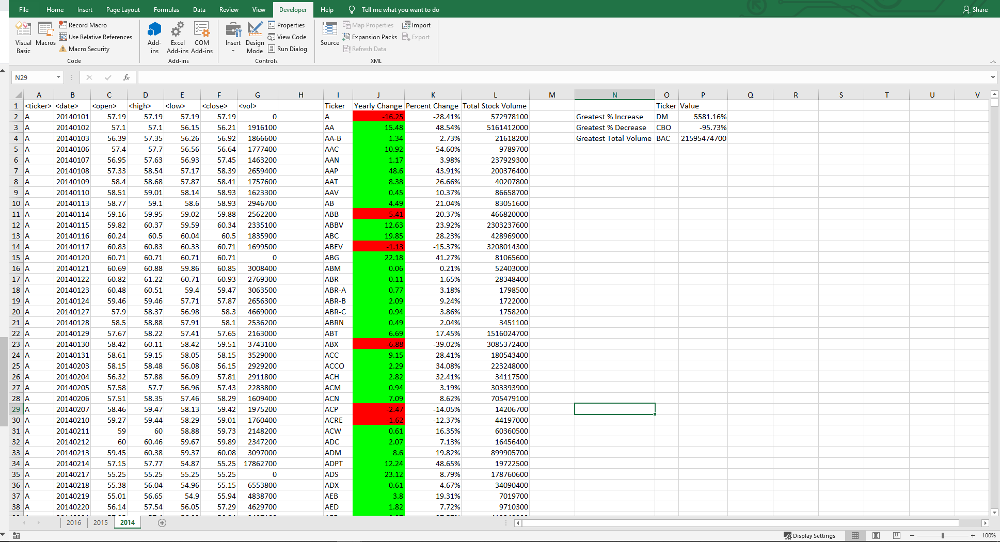
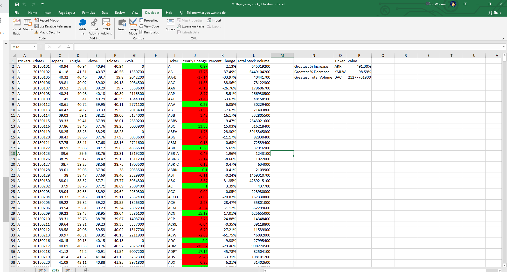
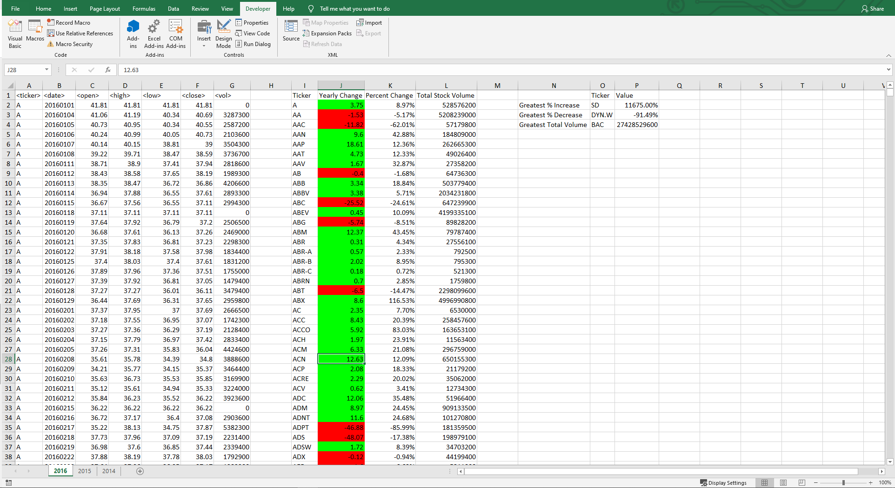

# VBA-Stocks
This is the submission folder for Homework 2.

## Approach
I didn't realize that Challenge 1 and 2 were meant to be developed seperately, so both [Challenge1.vbs](Challenge1.vbs) and [Challenge2.vbs](Challenge2.vbs) share most of the same code.  While we weren't taught functions in the bootcamp during the VBA section, I broke my code up into functions and used them for this homework.  This made it easy to adjust the code to meet both challenges.  My primary code is [Challenge2.vbs](Challenge2.vbs).

## Running the Code
1. Open either xlsx file out of the [Class Gitlab for this homework](https://umn.bootcampcontent.com/University-of-Minnesota-Boot-Camp/uofm-stp-data-pt-06-2020-u-c/tree/master/02-Homework/02-VBA-Scripting/Instructions/Resources/).  
2. Go to the Developer tab on the ribbon and click on the Visual Basic link.
3. On the menu bar, go to File > Import File and navigate to the [VBA-Stocks directory](../VBA-Stocks) and load in either vbs files.  You may need to adjust the file explorer to look for All Files rather than VB Files.
4. Use the Play button to run the code.  If prompted, pick the WallStreet() Sub to run. This may take a minute or two to run depending on the data size.  Once complete, you should see the results within the spreadsheets.

## Results
The screenshots are the results of running [Challenge2.vbs](Challenge2.vbs) on the [Multiple_year_stock_data.xlsx](https://umn.bootcampcontent.com/University-of-Minnesota-Boot-Camp/uofm-stp-data-pt-06-2020-u-c/blob/master/02-Homework/02-VBA-Scripting/Instructions/Resources/Multiple_year_stock_data.xlsx) file.  The file after it was ran can be found in the [Results folder](../Results/Multiple_year_stock_data.xlsm) if you'd like to see the full results beyond these screenshots.

### 2014 Results

### 2015 Results

### 2016 Results
